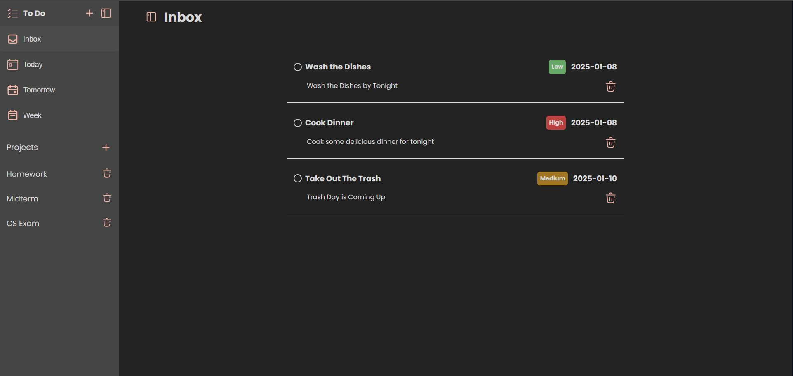

# To-Do-List

A To Do List project that has a user-friendly and easy to navigate UI, created with HTML, CSS, Javascript, and Webpack.

### Overview:

#### Features:

- Add Todo Items to Different Inboxes
- Add a title, description, date, priority, and inbox location
- Data is stored in localStorage
- Create separate projects
- The ability to delete Todo list items
- If the date is set to tomorrow or a week from now, it will be added to its respective inbox

#### Tools:

- Visual Studio Code
- HTML
- CSS
- Javascript
- Webpack
- Git
